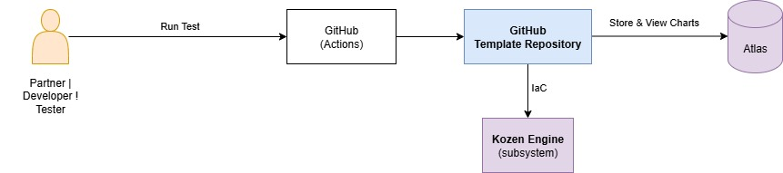
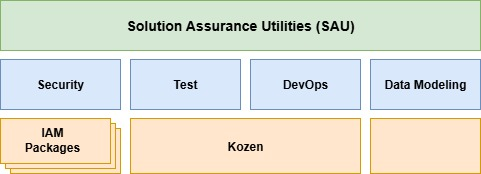
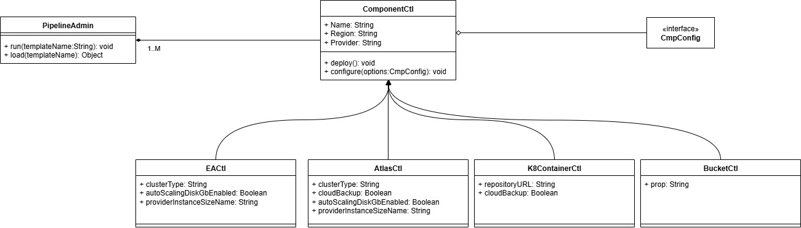
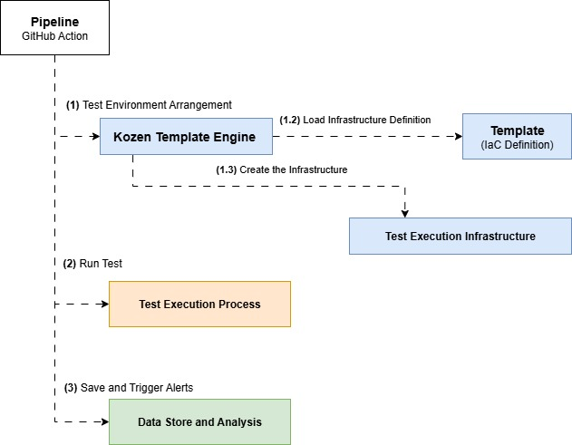
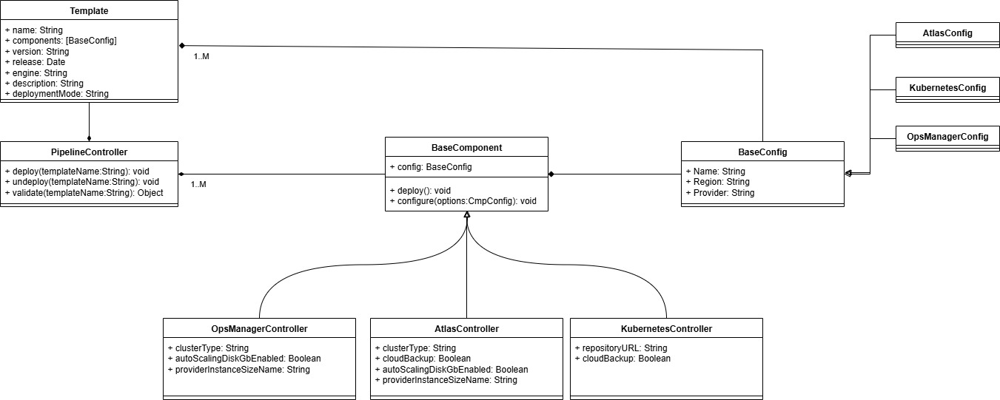
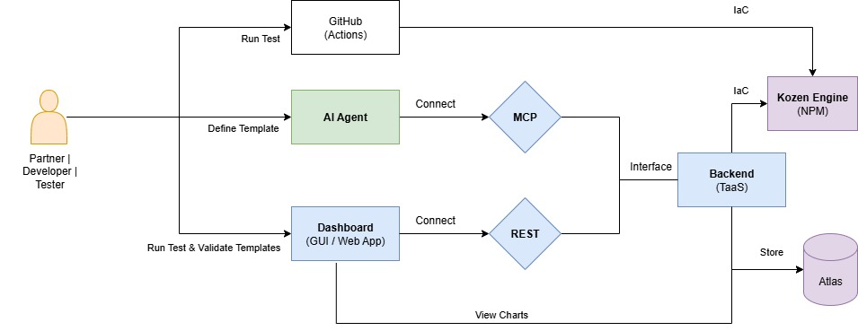

# Kozen Engine - Dynamic Infrastructure & Testing Pipeline Platform

Kozen Engine is an enterprise-grade framework designed for automated task execution within CI/CD pipelines, with robust support for Infrastructure as Code (IaC), testing automation, and data analytics. Developed in TypeScript for maximum flexibility, it empowers users to deploy infrastructure seamlessly, execute multi-dimensional testing workflows, and visualize insights through MongoDB Charts.

## 🎯 Overview

Kozen Engine simplifies the creation of dynamic, configuration-driven pipelines by transforming JSON templates into highly automated workflows for infrastructure and testing. With its extensible architecture, it serves as a versatile solution for Infrastructure as a Service (IaaS) and Testing as a Service (TaaS) platforms.

### Key Objectives

- **Dynamic Pipeline Creation**: Generate pipelines from JSON configuration files (`cfg/config.json`) and templates (`cfg/templates/demo.json`)
- **Infrastructure as Code**: Deploy and manage cloud infrastructure dynamically across multiple providers
- **Comprehensive Testing**: Execute end-to-end, integration, and performance tests as part of the pipeline
- **Data Analytics**: Collect and store all execution data in MongoDB for visualization with MongoDB Charts
- **NPM Distribution**: Package-ready for easy integration into existing projects and platforms



## 🚀 Quick Start

```bash
# Install dependencies
npm install

# Get template documentation
npm run dev -- --action=template:help

# Deploy infrastructure with testing pipeline
npm run dev -- --template=atlas.basic --config=cfg/config.json --action=deploy

# Execute validation and tests
npm run dev -- --template=demo --config=cfg/config.json --action=validate

# Clean up resources
npm run dev -- --template=atlas.basic --config=cfg/config.json --action=undeploy
```

## 🏗️ Architecture & Components

The [**Kozen Engine**](https://github.com/mongodb-industry-solutions/kozen-engine) is an essential component that contains all the necessary implementation to launch and operate the testing platform.



As seen in the previous image, Kozen is part of the SAU project. It serves as a crucial abstraction layer built on top of Pulumi, managing and orchestrating the deployment of testing environment definition templates.


Please keep in mind that everything observed whether it's errors, bugs, features, suggestions, ideas, etc. should be logged in the "Issues" section of the following GitHub repository: [https://github.com/mongodb-industry-solutions/kozen-engine/issues](https://github.com/mongodb-industry-solutions/kozen-engine/issues). This ensures our team can track these items effectively and helps the project evolve successfully.

### Core Extensible Components

The **Kozen Engine** follows an extensible, plugin-based architecture with three core extensible managers:

- **StackManager**: Dynamic infrastructure orchestration with pluggable providers
- **TemplateManager**: Flexible template storage and retrieval system
- **SecretManager**: Multi-provider secret management with security abstraction



### Mono-Stack Pipeline Concept

Each template defines a single stack instance composed of:

- **Components List**: Ordered sequence of infrastructure and testing components
- **Input/Output Configuration**: Data flow between components
- **Setup Parameters**: Initial configuration and environment setup



Each component autonomously decides its execution behavior and can:

- Deploy cloud infrastructure
- Execute various test types (e2e, integration, performance)
- Call external APIs
- Run CLI commands
- Collect and process data

### Logical System View



## 📚 Documentation

| Topic                     | Description                                       | Link                                                           |
| ------------------------- | ------------------------------------------------- | -------------------------------------------------------------- |
| **Architecture**          | Detailed system architecture and component design | [docs/architecture.md](docs/architecture.md)                   |
| **Components**            | Component system and extensibility guide          | [docs/components.md](docs/components.md)                       |
| **Configuration**         | Configuration files and environment setup         | [docs/configuration.md](docs/configuration.md)                 |
| **Environment Variables** | Complete environment variables reference guide    | [docs/environment-variables.md](docs/environment-variables.md) |
| **Templates**             | Template system and creation guide                | [docs/templates.md](docs/templates.md)                         |
| **Testing**               | Testing capabilities and execution patterns       | [docs/testing.md](docs/testing.md)                             |
| **API Reference**         | Complete API documentation                        | [docs/api-reference.md](docs/api-reference.md)                 |
| **Deployment**            | Production deployment and NPM integration         | [docs/deployment.md](docs/deployment.md)                       |
| **Contributing**          | Development, extension, and contribution guide    | [docs/contributing.md](docs/contributing.md)                   |

### Template System Architecture


## 🔧 Core Features

### 🏭 Extensible Stack Management

- **StackManagerPulumi**: Infrastructure-focused Pulumi automation
- **StackManagerNode**: Node.js runtime execution environment
- **Custom Providers**: Extensible architecture for additional stack managers

### 📋 Flexible Template System

- **TemplateManagerFile**: File system-based template storage
- **TemplateManagerMDB**: MongoDB-based template management
- **Multi-Source Support**: Extensible to additional storage providers

### 🔐 Multi-Provider Secret Management

- **SecretManagerAWS**: AWS Secrets Manager integration
- **SecretManagerMDB**: MongoDB-based secure secret storage
- **Provider Agnostic**: Support for additional secret providers

### 📊 Data Collection & Analytics

- **MongoDB Integration**: Comprehensive data storage
- **Chart Visualization**: MongoDB Charts for statistical analysis
- **Execution Tracking**: Complete pipeline execution monitoring

## 🎮 Usage Examples

### Basic Infrastructure Deployment

```bash
# Deploy MongoDB Atlas cluster
npm run dev -- --template=atlas.basic --config=cfg/config.json --action=deploy

# Deploy Kubernetes resources
npm run dev -- --template=k8s.standard --config=cfg/config.json --action=deploy
```

### Testing Pipeline Execution

```bash
# Run end-to-end tests
npm run dev -- --template=e2e.tests --config=cfg/config.json --action=validate

# Execute performance testing
npm run dev -- --template=performance.suite --config=cfg/config.json --action=validate
```

### Multi-Component Pipeline

```bash
# Deploy infrastructure + run tests + collect data
npm run dev -- --template=full.pipeline --config=cfg/config.json --action=deploy
```

### Undeploy by project and stack

```bash
# Option 1: pass both project and stack explicitly
ts-node bin/pipeline.ts --action=undeploy --project=K2025080114570884 --stack=DEV

# Option 2: use env var for project, pass stack on the command
export KOZEN_PROJECT=K2025080114570884
ts-node bin/pipeline.ts --action=undeploy --stack=DEV

# Or via npm script
npm run test:undeploy -- --project=K2025080114570884 --stack=DEV
```

Notes:

- Stack names are case-sensitive.
- An input like `K2025080114570884/` will be normalized (trailing slash ignored).


## 📦 NPM Package Integration

Kozen Engine is designed for distribution as an NPM package, enabling:

```typescript
import { PipelineManager, IoC } from "kozen-engine";

const ioc = new IoC();
const pipeline = new PipelineManager(ioc);

// Deploy infrastructure
await pipeline.deploy({
  template: "atlas.basic",
  config: "cfg/config.json",
  action: "deploy",
});

// Execute tests
await pipeline.validate({
  template: "e2e.tests",
  config: "cfg/config.json",
  action: "validate",
});
````

## 🛠️ Development

### Prerequisites

- Node.js 16.0.0 or higher
- TypeScript 5.0.0 or higher
- MongoDB instance (for data storage and templates)
- Cloud provider credentials (AWS, etc.)

### Project Structure

```
kozen-engine/
├── bin/                   # CLI entry points
├── cfg/                   # Configuration files
│   ├── config.json        # Main configuration
│   └── templates/         # Template definitions
├── src/                   # Source code
│   ├── components/        # Infrastructure & testing components
│   ├── controllers/       # Request handling layer
│   ├── models/            # Data models and interfaces
│   ├── services/          # Core business logic
│   └── tools/             # Utility libraries (IoC, logging)
└── docs/                  # Comprehensive documentation
```

## 🤝 Contributing

Kozen Engine is designed for extensibility and welcomes contributions! Whether you're adding new components, extending services, or improving documentation, we have comprehensive guides to help you.

### Quick Start for Contributors

1. **Fork and Clone**

   ```bash
   git clone https://github.com/your-username/kozen-engine.git
   cd kozen-engine
   npm install
   ```

2. **Set Up Development Environment**

   ```bash
   # Create debug environment
   export KOZEN_TEMPLATE=demo
   export KOZEN_STACK=dev
   export NODE_ENV=development
   ```

3. **Use VSCode Debugging**

   - Open in VSCode
   - Use F5 → "🛠️ Develop" for debugging
   - Set breakpoints in components/services
   - Test with different templates via environment variables

4. **Create Your Enhancement**

   - **New Components**: Add to `src/components/`
   - **New Services**: Extend `StackManager`, `SecretManager`, or `TemplateManager`
   - **New Templates**: Add to `cfg/templates/`

5. **Submit Pull Request**
   ```bash
   git checkout -b feature/amazing-feature
   git commit -m 'feat: add amazing feature'
   git push origin feature/amazing-feature
   ```

### Extension Points

- **📦 Components**: Create infrastructure, testing, or processing components
- **🔧 Stack Managers**: Add support for new orchestration platforms (Terraform, Ansible, etc.)
- **🔐 Secret Managers**: Integrate with additional secret providers (HashiCorp Vault, Azure Key Vault)
- **📄 Template Managers**: Add new template storage backends (Git, S3, HTTP APIs)

**📚 Complete Guide**: See [docs/contributing.md](docs/contributing.md) for detailed development instructions, VSCode debugging setup, and extension patterns.

## 📄 License

This project is licensed under the MIT License - see the [LICENSE](LICENSE) file for details.

## 🔮 Future Vision



The next generation of Kozen Engine will expand capabilities to support multi-cloud deployments, advanced AI-driven testing, and enhanced analytics dashboards.

## 🆘 Support

- 📖 **Documentation**: [docs/](docs/)
- 🐛 **Issues**: [GitHub Issues](../../issues)
- 💬 **Discussions**: [GitHub Discussions](../../discussions)

---

**Built with ❤️ for the MongoDB Solution Assurance Team (SAT)**
