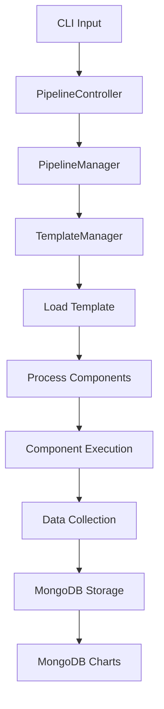
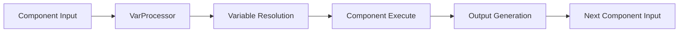
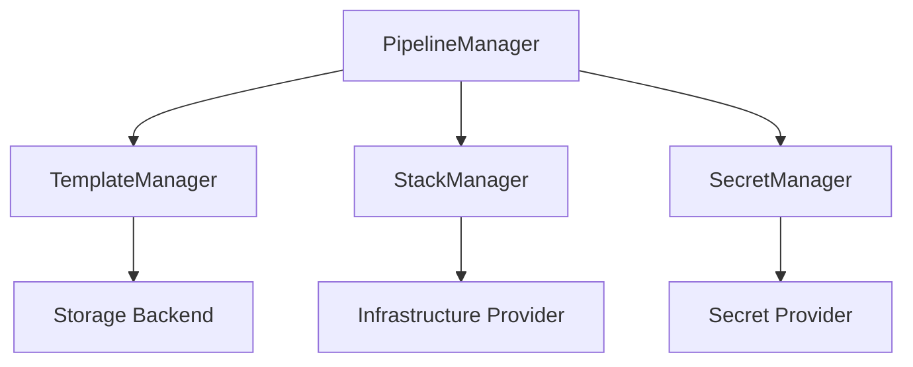

# Architecture Overview

## System Architecture

Kozen Engine implements a layered, extensible architecture designed for scalability, maintainability, and plugin-based extensibility. The system follows Domain-Driven Design principles with clear separation of concerns.

## Architecture Layers

### 1. CLI Layer (`bin/`)
**Purpose**: Entry point for command-line operations
- `pipeline.ts` - Main CLI application entry point
- Argument parsing and validation
- Error handling and user feedback

### 2. Controllers Layer (`src/controllers/`)
**Purpose**: Handle HTTP-like request/response patterns for CLI operations
- `BaseController.ts` - Abstract base for all controllers
- `PipelineController.ts` - Main pipeline operation orchestration
- Input validation and sanitization
- Response formatting and error handling

### 3. Services Layer (`src/services/`)
**Purpose**: Core business logic and orchestration
- `PipelineManager.ts` - Main pipeline orchestrator
- `StackManager.ts` - Infrastructure stack management abstraction
- `TemplateManager.ts` - Template storage and retrieval abstraction
- `SecretManager.ts` - Secret management abstraction
- `VarProcessorService.ts` - Variable resolution and processing

### 4. Components Layer (`src/components/`)
**Purpose**: Specialized infrastructure and testing components
- `Atlas.ts` - MongoDB Atlas infrastructure component
- `Kubernetes.ts` - Kubernetes resource management
- `OpsManager.ts` - MongoDB Ops Manager deployment
- `DemoFirst.ts` / `DemoSecond.ts` - Example/testing components

### 5. Models Layer (`src/models/`)
**Purpose**: Data structures, interfaces, and type definitions
- Type-safe interfaces for all system entities
- Configuration models
- Result and execution tracking models

### 6. Tools Layer (`src/tools/`)
**Purpose**: Framework utilities and cross-cutting concerns
- `ioc/` - Dependency injection container
- `log/` - Comprehensive logging system
- `util.ts` - Common utility functions

## Core Design Patterns

### 1. Bridge Pattern
The system extensively uses the Bridge pattern to separate abstractions from implementations:

```typescript
// Abstraction
abstract class StackManager {
    abstract deploy(config: IStackOptions): Promise<IResult>;
    abstract undeploy(config: IStackOptions): Promise<IResult>;
}

// Concrete Implementations
class StackManagerPulumi extends StackManager { }
class StackManagerNode extends StackManager { }
```

### 2. Strategy Pattern
Multiple implementations for the same interface allow runtime strategy selection:

```typescript
// Template storage strategies
class TemplateManagerFile extends TemplateManager { }
class TemplateManagerMDB extends TemplateManager { }

// Secret management strategies  
class SecretManagerAWS extends SecretManager { }
class SecretManagerMDB extends SecretManager { }
```

### 3. Factory Pattern
IoC container acts as a factory for creating and managing component instances:

```typescript
const component = await this.assistant.resolve<BaseController>(componentName);
```

### 4. Template Method Pattern
BaseController provides template method structure:

```typescript
abstract class BaseController {
    abstract deploy(input?: IStruct): Promise<IResult>;
    abstract validate(input?: IStruct): Promise<IResult>;
    abstract undeploy(input?: IStruct): Promise<IResult>;
}
```

## Extensibility Points

### 1. Stack Manager Extensions

Create new stack managers by extending the base class:

```typescript
export class StackManagerCustom extends StackManager {
    public async deploy(config: IStackOptions): Promise<IResult> {
        // Custom implementation
    }
    
    public async undeploy(config: IStackOptions): Promise<IResult> {
        // Custom implementation  
    }
}
```

### 2. Template Manager Extensions

Support new template storage backends:

```typescript
export class TemplateManagerS3 extends TemplateManager {
    async load<T>(templateName: string): Promise<T> {
        // S3-specific template loading
    }
}
```

### 3. Secret Manager Extensions

Add new secret providers:

```typescript
export class SecretManagerAzure extends SecretManager {
    public async resolve(key: string): Promise<string> {
        // Azure Key Vault integration
    }
}
```

### 4. Component Extensions

Create custom infrastructure or testing components:

```typescript
export class CustomTestComponent extends BaseController {
    async deploy(input?: IStruct): Promise<IResult> {
        // Custom test execution logic
    }
}
```

## Data Flow Architecture

### 1. Pipeline Execution Flow



### 2. Component Interaction



### 3. Service Layer Interaction



## Dependency Injection Architecture

### IoC Container Structure

The system uses a sophisticated IoC container with:

- **Auto-registration**: Automatic service discovery
- **Lifetime management**: Singleton, transient, scoped
- **Configuration-driven**: JSON-based service configuration
- **Type safety**: Full TypeScript support

### Service Registration

```typescript
const configs: ServiceConfig[] = [
    {
        key: 'StackManagerPulumi',
        target: StackManagerPulumi,
        type: 'class',
        lifetime: 'singleton'
    },
    {
        key: 'TemplateManagerFile', 
        target: TemplateManagerFile,
        type: 'class',
        lifetime: 'singleton'
    }
];

await container.register(configs);
```

## Security Architecture

### 1. Secret Management
- Abstracted secret resolution
- Multiple provider support
- Environment-based configuration
- Secure storage patterns

### 2. Configuration Security
- Environment variable isolation
- Credential abstraction
- Provider-agnostic security

### 3. Data Security
- MongoDB encryption support
- Secure transmission
- Access control patterns

## Performance Architecture

### 1. Lazy Loading
- Components loaded on demand
- Template caching strategies
- Resource optimization

### 2. Async Processing
- Promise-based architecture
- Parallel component execution
- Non-blocking operations

### 3. Memory Management
- Service lifetime control
- Resource cleanup patterns
- Efficient object creation

## Monitoring & Observability

### 1. Logging Architecture
- Multi-destination logging
- Structured log entries
- Performance tracking
- Error correlation

### 2. Execution Tracking
- Pipeline execution monitoring
- Component performance metrics
- Resource utilization tracking

### 3. Data Analytics
- MongoDB-based data storage
- MongoDB Charts visualization
- Execution statistics
- Performance analytics

## Technology Stack

### Core Technologies
- **TypeScript 5.0+**: Type-safe development
- **Node.js 16+**: Runtime environment
- **Pulumi**: Infrastructure as Code
- **MongoDB**: Data storage and analytics

### Key Dependencies
- **Awilix**: Dependency injection
- **MongoDB Driver**: Database connectivity
- **AWS SDK**: Cloud provider integration
- **Kubernetes Client**: Container orchestration

## Deployment Architecture

### 1. NPM Package Structure
```
kozen-engine/
├── dist/           # Compiled JavaScript
├── src/            # TypeScript source
├── package.json    # NPM package configuration
└── README.md       # Package documentation
```

### 2. Integration Patterns
- **Direct Import**: Use as library
- **CLI Tool**: Command-line usage
- **Service Integration**: Embed in applications
- **Platform Building**: Foundation for IaaS/TaaS

## Future Architecture Considerations

### 1. Microservices Migration
- Service decomposition strategy
- API gateway integration
- Service mesh considerations

### 2. Cloud-Native Evolution  
- Kubernetes-native deployment
- Serverless function support
- Container orchestration

### 3. Multi-Tenant Architecture
- Tenant isolation patterns
- Resource partitioning
- Security boundaries

### 4. Event-Driven Architecture
- Event sourcing patterns
- Message queue integration
- Reactive processing 