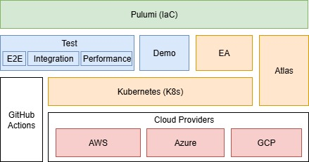
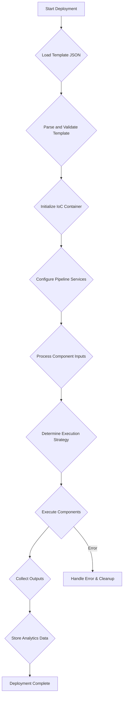

## Automated Testing Platform with Pulumi and IaC Templates

This project aims to create an automated testing execution platform that leverages Infrastructure as Code (IaC) using Pulumi. The core idea is to simplify infrastructure deployments for testing by defining reusable **templates**. Each template encapsulates all the necessary configurations to provision an entire infrastructure stack, enabling consistent, repeatable, and on-demand test environments.

-----

### 1\. Core Concepts and Principles

  * **Infrastructure as Code (IaC):** Managing and provisioning infrastructure through code instead of manual processes. This promotes consistency, version control, and automation.
  * **Pulumi:** An IaC framework that allows you to define infrastructure using popular programming languages (TypeScript, Python, Go, C\#, Java, YAML). This project will heavily rely on Pulumi's capabilities to manage cloud resources.
  * **Templates:** Pre-defined JSON configurations that describe the desired infrastructure. These templates act as blueprints for deploying specific testing environments. They abstract away the underlying Pulumi code, making it easier for users to provision complex setups without deep IaC knowledge.
  * **Component-Based Architecture:** The infrastructure described within templates is broken down into individual "components." Each component represents a specific cloud resource or service (e.g., an Atlas cluster, Kubernetes instances). This modularity enhances maintainability and extensibility.
  * **Automated Testing Integration:** The ultimate goal is to seamlessly integrate the infrastructure provisioning with automated testing frameworks, allowing tests to be executed against freshly provisioned and configured environments.

-----

### 2\. Template System

The template system is the core of Kozen Engine's configuration-driven approach. Templates define the structure, components, and data flow for infrastructure deployment and testing operations.

**📚 For complete template documentation, see [docs/templates.md](./templates.md)**

Templates support:
- **Dynamic variable resolution** through multiple input types (environment, secret, reference, value, protected)
- **Component orchestration** with both sequential and parallel execution strategies  
- **Cross-component dependencies** through input/output relationships
- **Flexible storage backends** (file system and MongoDB)

The core concepts of **input**, **output**, and **setup** maintain consistent behavior across both component-level and stack-level configurations, with the stack defining the initial configuration for the entire deployment process within a pipeline.

-----

### 3\. Component Architecture and Configuration Evolution

The component system has evolved from the original `BaseConfig` approach to a more flexible and dynamic configuration system.

#### 3.1. Modern Component Interface

Components now implement a standardized interface using generic input structures:

```typescript
async deploy(input?: IStruct, pipeline?: IPipeline): Promise<IResult>
async undeploy(input?: IStruct, pipeline?: IPipeline): Promise<IResult>
async validate(input?: IStruct, pipeline?: IPipeline): Promise<IResult>
async status(input?: IStruct, pipeline?: IPipeline): Promise<IResult>
```

#### 3.2. Dynamic Configuration Casting

Instead of the previous `BaseConfig` inheritance model, components now receive generic `IStruct` inputs and perform dynamic casting to specific configuration types within their implementation:

```typescript
export interface AtlasConfig {
  projectId: string;
  clusterType: "REPLICASET" | "SHARDED";
  mongoDbMajorVersion: string;
  providerInstanceSizeName: string;
  cloudBackup: boolean;
  region: string;
  // ... other Atlas-specific properties
}

export class AtlasController extends BaseController {
  async deploy(input?: IStruct, pipeline?: IPipeline): Promise<IResult> {
    // Dynamic casting to specific configuration type
    const atlasConfig = this.castToAtlasConfig(input);
    
    // Validate configuration
    this.validateAtlasConfig(atlasConfig);
    
    // Use typed configuration for deployment
    const cluster = await this.deployAtlasCluster(atlasConfig);
    
    return {
      success: true,
      output: {
        connectionString: cluster.connectionString,
        clusterId: cluster.id
      },
      timestamp: new Date()
    };
  }

  private castToAtlasConfig(input?: IStruct): AtlasConfig {
    if (!input?.projectId) {
      throw new Error("Atlas configuration requires projectId");
    }
    
    return {
      projectId: input.projectId as string,
      clusterType: (input.clusterType as string) || "REPLICASET",
      mongoDbMajorVersion: (input.mongoDbMajorVersion as string) || "8.0",
      providerInstanceSizeName: (input.providerInstanceSizeName as string) || "M10",
      cloudBackup: input.cloudBackup !== undefined ? Boolean(input.cloudBackup) : true,
      region: (input.region as string) || "us-east-1"
    };
  }

  private validateAtlasConfig(config: AtlasConfig): void {
    if (!["REPLICASET", "SHARDED"].includes(config.clusterType)) {
      throw new Error(`Invalid cluster type: ${config.clusterType}`);
    }
    // Additional validation logic
  }
}
```

#### 3.3. Type-Safe Configuration Examples

**Kubernetes Component Example:**

```typescript
export interface KubernetesConfig {
  namespace: string;
  replicas: number;
  image: string;
  containerPort: number;
  serviceType: "ClusterIP" | "NodePort" | "LoadBalancer";
  databaseUrl?: string;
}

export class KubernetesController extends BaseController {
  async deploy(input?: IStruct, pipeline?: IPipeline): Promise<IResult> {
    const k8sConfig = this.castToKubernetesConfig(input);
    
    this.logger?.info({
      src: 'component:Kubernetes:deploy',
      message: `Deploying to namespace: ${k8sConfig.namespace}`,
      data: {
        replicas: k8sConfig.replicas,
        image: k8sConfig.image,
        prefix: this.getPrefix(pipeline)
      }
    });

    const deployment = await this.deployKubernetesResources(k8sConfig);
    
    return {
      success: true,
      output: {
        serviceUrl: deployment.serviceUrl,
        namespace: deployment.namespace
      },
      timestamp: new Date()
    };
  }

  private castToKubernetesConfig(input?: IStruct): KubernetesConfig {
    return {
      namespace: (input?.namespace as string) || "default",
      replicas: Number(input?.replicas) || 1,
      image: (input?.image as string) || "nginx:latest",
      containerPort: Number(input?.containerPort) || 80,
      serviceType: (input?.serviceType as "ClusterIP" | "NodePort" | "LoadBalancer") || "ClusterIP",
      databaseUrl: input?.databaseUrl as string
    };
  }
}
```

**📚 For detailed component implementation examples, see [docs/components.md](./components.md)**

#### 3.4. Benefits of the New Approach

- **Flexibility**: Components can handle dynamic configurations without rigid inheritance
- **Type Safety**: Internal casting provides compile-time type checking within components
- **Extensibility**: Easy to add new configuration properties without breaking existing templates
- **Validation**: Components can implement custom validation logic for their specific requirements
- **Pipeline Context**: Components have access to full pipeline context for advanced scenarios

-----

### 4\. System Architecture and Logic

The platform follows a clear architectural pattern, separating concerns into distinct logical units with enhanced flexibility for component execution strategies.

#### 4.1. High-Level Architecture Diagram



#### 4.2. Enhanced Component Execution

The system now supports multiple execution strategies through composition components:

- **Sequential Execution**: Components execute in order, enabling output dependencies
- **Parallel Execution**: Composition components group related components for concurrent execution
- **Hybrid Strategies**: Mix of sequential and parallel execution based on component dependencies

The previous `deploymentMode` property has been replaced with intelligent orchestration through composition components that handle parallelization automatically.

#### 4.3. Detailed Component Breakdown

##### 4.3.1. Template Store

  * **Description:** A repository (e.g., file system, MongoDB) where all the defined JSON templates are stored.
  * **Logic:** Provides a centralized location for managing and versioning templates. The `PipelineController` interacts with this store to load templates.

##### 4.3.2. Validation Engine

  * **Description:** Responsible for pre-deployment validation of templates and component configurations.
  * **Logic:**
    1.  When a template is selected for deployment, the `PipelineController` invokes the Validation Engine.
    2.  It validates template structure, required variables, and component configurations.
    3.  For each component, it verifies that required inputs are available and properly typed.
    4.  Returns validation errors or success status with detailed feedback.

##### 4.3.3. Deployment Orchestrator (PipelineController)

  * **Description:** The central orchestrator responsible for loading templates, coordinating validations, and managing component execution.
  * **Enhanced Methods:**
      * **`execute(args: IPipelineArgs): Promise<IResult>`:**
        1.  Loads and validates the specified template.
        2.  Configures the pipeline with IoC dependencies.
        3.  Determines execution strategy based on component dependencies.
        4.  Coordinates component execution with proper input/output flow.
        5.  Collects and aggregates results from all components.

##### 4.3.4. Enhanced Component Controllers

Components now follow a more flexible architecture:

```typescript
export abstract class BaseController {
  protected assistant!: IIoC;
  protected config: IComponent;
  protected logger?: ILogger;

  abstract deploy(input?: IStruct, pipeline?: IPipeline): Promise<IResult>;
  abstract undeploy(input?: IStruct, pipeline?: IPipeline): Promise<IResult>;
  abstract validate(input?: IStruct, pipeline?: IPipeline): Promise<IResult>;
  abstract status(input?: IStruct, pipeline?: IPipeline): Promise<IResult>;

  // Utility method for prefix generation
  protected getPrefix(pipeline?: IPipeline): string {
    const project = pipeline?.stack?.config?.project || 'K' + Date.now();
    const stack = pipeline?.stack?.config?.name || 'dev';
    return `${project}-${stack}`;
  }
}
```

#### 4.4. Flow Diagrams

##### 4.4.1. Enhanced Deployment Flow



-----

### 5\. Key Design Improvements and Benefits

  * **Enhanced Extensibility:** The generic `IStruct` approach makes it easier to add new component types without modifying the core framework.
  * **Better Type Safety:** Components can implement strong typing internally while maintaining interface flexibility.
  * **Improved Maintainability:** Clear separation between framework concerns and component-specific logic.
  * **Pipeline Context Awareness:** Components have access to full pipeline context for advanced scenarios.
  * **Flexible Orchestration:** Composition components enable sophisticated execution strategies without hardcoded deployment modes.
  * **Rich Analytics:** Enhanced data collection provides better insights into pipeline execution patterns.

-----

### 6\. Future Enhancements

  * **AI-Driven Component Recommendations:** Machine learning models to suggest optimal component configurations.
  * **Advanced Dependency Resolution:** Sophisticated dependency graph analysis for optimal parallel execution.
  * **Multi-Cloud Orchestration:** Enhanced support for cross-cloud deployments and hybrid scenarios.
  * **Real-Time Monitoring:** Live dashboard for pipeline execution monitoring and intervention capabilities.
  * **Template Marketplace:** Community-driven template sharing and contribution platform.

**📚 For development and contribution guidelines, see [docs/contributing.md](./contributing.md)**

